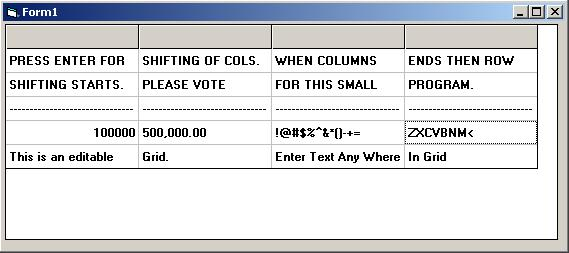



## Editable MSFlexGrid

### Description

This program shows how you can edit or write in MS FlexGrid without placing any text boxes over it.
 
### More Info
 

             |
---                |---
**Submitted On**   |2006-07-10 13:50:02
**By**             |[M\.Mehdi](https://github.com/Planet-Source-Code/PSCIndex/blob/master/ByAuthor/m-mehdi.md)
**Level**          |Intermediate
**User Rating**    |4.8 (19 globes from 4 users)
**Compatibility**  |VB 6\.0
**Category**       |[Coding Standards](https://github.com/Planet-Source-Code/PSCIndex/blob/master/ByCategory/coding-standards__1-43.md)
**World**          |[Visual Basic](https://github.com/Planet-Source-Code/PSCIndex/blob/master/ByWorld/visual-basic.md)
**Archive File**   |[Editable\_M2005467102006\.zip](https://github.com/Planet-Source-Code/m-mehdi-editable-msflexgrid__1-65914/archive/master.zip)

